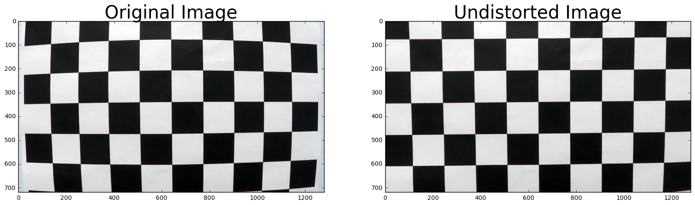
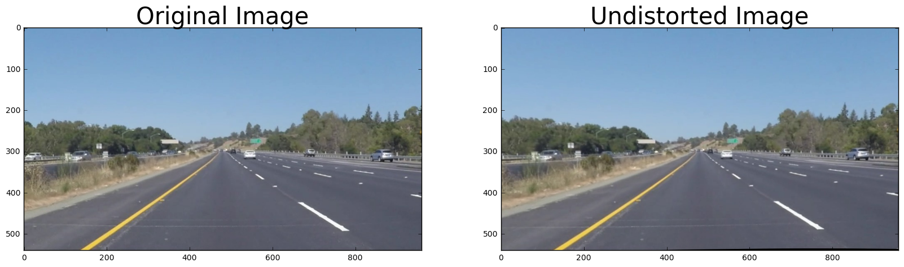
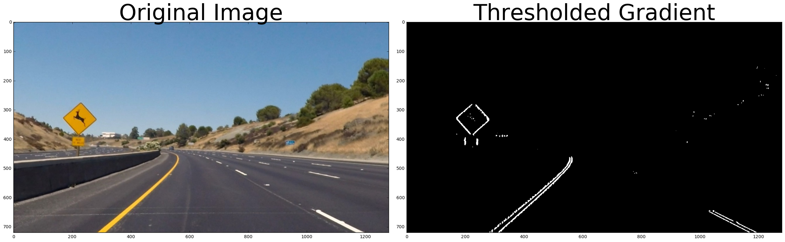
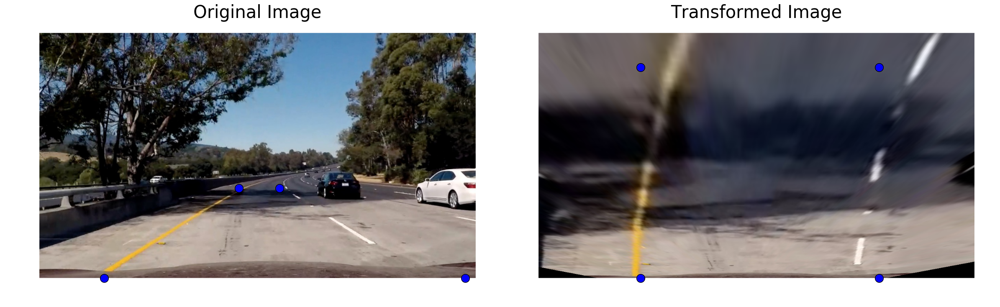
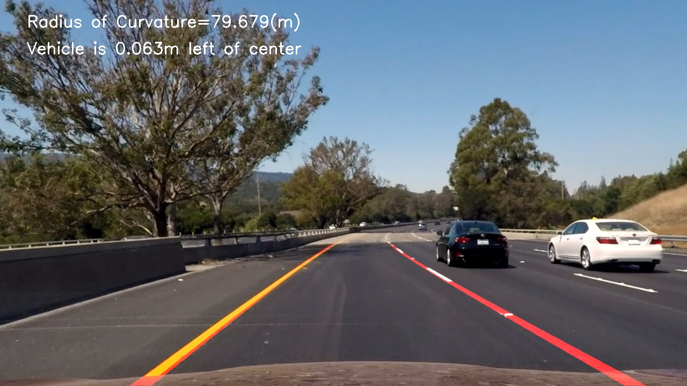

## Writeup Template
---

**Advanced Lane Finding Project**

The goals / steps of this project are the following:

* Compute the camera calibration matrix and distortion coefficients given a set of chessboard images.
* Apply a distortion correction to raw images.
* Use color transforms, gradients, etc., to create a thresholded binary image.
* Apply a perspective transform to rectify binary image ("birds-eye view").
* Detect lane pixels and fit to find the lane boundary.
* Determine the curvature of the lane and vehicle position with respect to center.
* Warp the detected lane boundaries back onto the original image.
* Output visual display of the lane boundaries and numerical estimation of lane curvature and vehicle position.

[//]: # (Image References)

[image1]: ./examples/undistort_output.png "Undistorted"
[image2]: ./test_images/test1.jpg "Road Transformed"
[image3]: ./examples/binary_combo_example.jpg "Binary Example"
[image4]: ./examples/warped_straight_lines.jpg "Warp Example"
[image5]: ./examples/color_fit_lines.jpg "Fit Visual"
[image6]: ./examples/example_output.jpg "Output"
[video1]: ./project_video.mp4 "Video"

## [Rubric](https://review.udacity.com/#!/rubrics/571/view) Points

### Here I will consider the rubric points individually and describe how I addressed each point in my implementation.  

---

### Writeup / README

#### 1. Provide a Writeup / README that includes all the rubric points and how you addressed each one.  You can submit your writeup as markdown or pdf.  [Here](https://github.com/udacity/CarND-Advanced-Lane-Lines/blob/master/writeup_template.md) is a template writeup for this project you can use as a guide and a starting point.

### Camera Calibration

#### 1. Briefly state how you computed the camera matrix and distortion coefficients. Provide an example of a distortion corrected calibration image.

Most of the code were used from the lecture quizzes. The code for this step is contained in the first code cell of the cam_cal.py file.  

I start by preparing "object points", which will be the (x, y, z) coordinates of the chessboard corners in the world. Here I am assuming the chessboard is fixed on the (x, y) plane at z=0, such that the object points are the same for each calibration image.  Thus, `objp` is just a replicated array of coordinates, and `objpoints` will be appended with a copy of it every time I successfully detect all chessboard corners in a test image.  `imgpoints` will be appended with the (x, y) pixel position of each of the corners in the image plane with each successful chessboard detection.  

I then used the output `objpoints` and `imgpoints` to compute the camera calibration and distortion coefficients using the `cv2.calibrateCamera()` function.  I applied this distortion correction to the test image using the `cv2.undistort()` function and obtained this result:

### Pipeline (single images)

#### 1. Provide an example of a distortion-corrected image.

To demonstrate this step, I will describe how I apply the distortion correction to one of the test images like this one:

#### 2. Describe how (and identify where in your code) you used color transforms, gradients or other methods to create a thresholded binary image.  Provide an example of a binary image result.

I used a combination of color and gradient thresholds to generate a binary image (thresholding steps at lines 18 through 88 in 'video.py').  Here's an example of my output for this step.  (note: this is not actually from one of the test images)

#### 3. Describe how (and identify where in your code) you performed a perspective transform and provide an example of a transformed image.

The code for my perspective transform includes a function called `warper()`, which appears in lines 1 through 8 in the file `example.py` (output_images/examples/example.py).  The code takes as inputs an image (`img`), as well as source (`src`) and destination (`dst`) points.  I chose to code the source and destination points in the following manner:

src=np.float32([[img.shape[1]\*(0.5-mid_width/2),img.shape[0]\*height_pct],
                 [img.shape[1]\*(0.5+mid_width/2),img.shape[0]\*height_pct],
                 [img.shape[1]\*(0.5+bot_width/2),img.shape[0]\*bottom_trim],
                 [img.shape[1]\*(0.5-bot_width/2),img.shape[0]\*bottom_trim]])
dst=np.float32([[offset,0],[img_size[0]-offset,0],[img_size[0]-offset,img_size[1]],[offset,img_size[1]]])

I verified that my perspective transform was working as expected by drawing the `src` and `dst` points onto a test image and its warped counterpart to verify that the lines appear parallel in the warped image.

#### 4. Describe how (and identify where in your code) you identified lane-line pixels and fit their positions with a polynomial?
I used a window sliding and convolution approach as described in the lectures in my code ('tracker.py'). To find the target pixels a window template is used to go over the desired region (one window convolves over another to generate a new transformation). The result is a trapezoidal window.
1. Break window into 9 vertical slices
2. Squash left and right vertical slices and pick the maximum values
3. Iterate through other slices
4. Obtain 9 centroids for each of the slices
5. Average over all of the above centroids
A polyfit function was used to  fit my lane lines with a 2nd order polynomial as seen on line 172 on video.py.

#### 5. Describe how (and identify where in your code) you calculated the radius of curvature of the lane and the position of the vehicle with respect to center.

I did this in lines 174 through 183 in my code in `video.py`. I assumed that the camera is in the center of car and then average left and right lane positions.

#### 6. Provide an example image of your result plotted back down onto the road such that the lane area is identified clearly.

Here is an example of my result on a test image:

---

### Pipeline (video)

#### 1. Provide a link to your final video output.  Your pipeline should perform reasonably well on the entire project video (wobbly lines are ok but no catastrophic failures that would cause the car to drive off the road!).

Here's a [link to my video result](output_video.mp4)

---

### Discussion

#### 1. Briefly discuss any problems / issues you faced in your implementation of this project.  Where will your pipeline likely fail?  What could you do to make it more robust?

First, the on board camera metrics and distortion coefficients were obtained to undistort the images. The color space is transformed from RGB to HLS to HSV to find white and yellow lines. Sobel threshold is used to detect edges. Finally I put it together by a color threshold and saving a binary output image. The lane lines were later obtained using a sliding and convolution approach.
The code fails to perform well in situations that have too many artifacts in image such as trees. Curvatures of very high degree also fail but this can be solved by choosing a polynomial of higher degree
